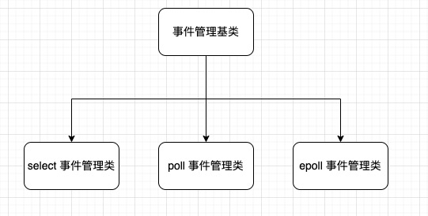
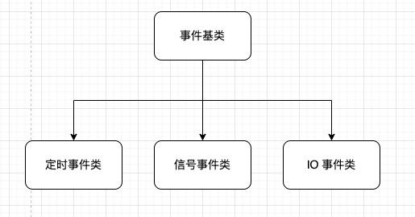

# Libevent_cpp
libevent_cpp 是基于事件的网络库，思考启发来源于 libevent 项目。目标是实现一款高性能网络库。

项目中正在优化维护中...

## 一、简介

本项目目前核心分为两种类，一种为事件管理类、一种为事件类。
- 事件管理类：负责整体的事件调度、处理事件
- 事件类：由用户创建自定义的事件，实现业务

事件管理类分别由 select、poll、epoll 这三个 linux 的高级 IO 为基础实现。




事件类分为定时事件、信号事件、IO 事件



然后，通过一个例子来说明
```c++
void signal_cb() {
    std::cout << "signal call back" << std::endl;
}

int main() {
    // 创建事件管理类
    auto event_base = std::make_shared<libevent_cpp::select_base>();
    event_base->init();

    // 创建信号事件
    auto event = libevent_cpp::create_event<libevent_cpp::signal_event>(SIGINT);
    // 设置此信号事件触发时的回调函数
    event->set_callback(signal_cb);
    // 设置此事件为持久的。对应非持久为此事件只被执行一次
    event->set_persistent();

    // 将信号事件添加到事件管理集合中
    event_base->add_event(event);

    // run
    event_base->start_dispatch();
}
```

## 二、使用

如下进行编译
```
git clone git@github.com:noahyzhang/libevent-cpp.git
cd libevent_cpp
mkdir build
cd build
cmake ..
make -j4
```

编译后会生成动态库文件，结合头文件，即可在项目中使用
